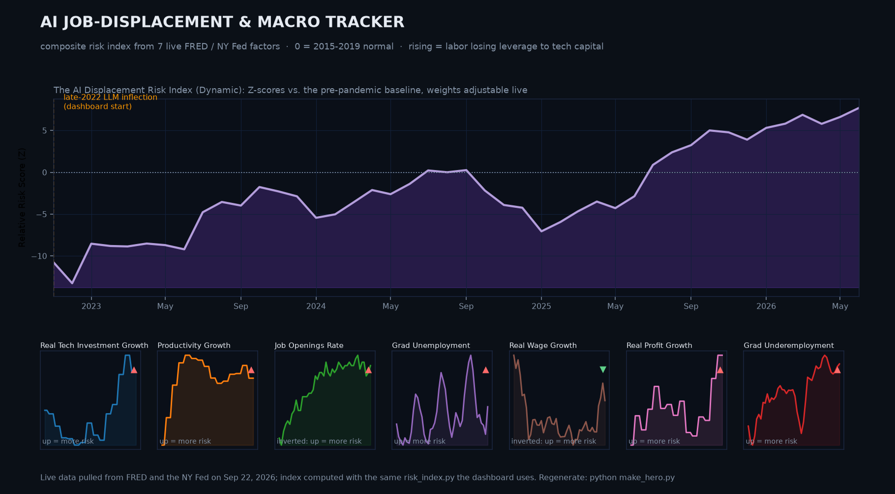

# AI Job Displacement & Macroeconomic Tracker

I built this project because looking at aggregate national data often hides what is actually happening in specific sectors, especially tech. This is a local-first Streamlit dashboard that pulls from several government APIs to measure whether labor is losing leverage to tech capital. 

It tracks a mix of macroeconomic indicators and micro-level labor data, and calculates a dynamic risk index that you can adjust on the fly.



*The composite risk index over the 7 factors, all weights at 1, from live FRED and NY Fed data pulled at generation time. It uses the same `risk_index.py` as the dashboard. Regenerate with `python make_hero.py`.*

### What it tracks

* **Macro trends:** Total tech investment, labor productivity, and national job openings.
* **Labor health:** Recent graduate unemployment, average wage growth, corporate profits, and labor's share of output.
* **Micro tech trends:** Layoffs and hiring demand specifically within the Information Sector (software, data, and web).
* **The graduate squeeze:** Recent-grad unemployment versus all workers, grad underemployment, and outcomes by college major (is Computer Science still a safe bet?).
* **Canaries in AI-exposed jobs:** Whether young workers are losing ground in the occupations most exposed to LLMs, compared with older workers in the same jobs. More on this below.

### How the risk index works

Every factor gets put on the same footing before it's combined:

1. **Things that trend on their own become growth rates.** Tech investment, productivity, wages, and labor share all drift over time no matter what AI is doing, so the index uses their year-over-year change instead. Tech investment and wages have CPI inflation subtracted, which matters a lot in 2021-2023: nominal wages were rising fast but real wages were falling.
2. **Rates stay as rates.** The job openings rate and grad underemployment already mean something on their own.
3. **Grads are compared to their own age group.** A recession pushes up unemployment for everyone, so raw grad unemployment mostly tracks the business cycle. The index uses the gap between bachelor's holders aged 20-24 and everyone aged 20-24 instead. Age and the cycle hit both groups, so what's left is what the degree is worth. In 2014 young grads' unemployment ran about 4 points below their peers'; in 2026 the edge is down to about half a point. Both series come from the same survey and aren't seasonally adjusted, so the gap gets a 3-month average.
4. **Labor share is the most direct measure.** It's workers' share of business output, which is pretty much the definition of labor losing leverage to capital.
5. **Everything is scored against 2015-2019.** Each factor becomes a Z-score relative to its pre-pandemic, pre-LLM average, and factors where a higher number is good for workers get flipped. So 0 is "normal" and up always means more risk.
6. **Weighted average.** The sidebar sliders set each factor's weight, and the index is the weighted average, so +1 means one standard deviation worse for labor than 2015-2019. Because it's an average, the scale doesn't shift if a source fails to load. Changing the start date only crops the chart; it doesn't rescore anything.

Quarterly series fill the months inside their own quarter and nothing past it, so the index is monthly and ends at the last month every factor has data for. The math lives in `risk_index.py`, which both the dashboard and `make_hero.py` import.

### Are young workers being pushed out of AI-exposed jobs?

The risk index only uses aggregate numbers, so it can't tell AI apart from an ordinary profit cycle. Phase 5 runs a sharper test, borrowed from Brynjolfsson, Chandar & Chen's *Canaries in the Coal Mine* (2025). They used ADP payroll data and found that 22-25 year olds lost ground in the most AI-exposed occupations while older workers in those same jobs didn't.

This version rebuilds that test from public data:

1. Every month of the Census Current Population Survey since 2015 (about 50,000 employed people a month) gives each worker's age, education, and occupation.
2. Each occupation gets an LLM exposure score from [Eloundou et al. (2023)](https://arxiv.org/abs/2303.10130). Census occupation codes changed in 2020, so the 2015-2019 files go through the Census 2010-to-2018 crosswalk. Every employed person in both eras ends up with a score.
3. Occupations are split into fifths so each held about 20% of workers in 2019.
4. The chart shows what share of each age group works in a given fifth, indexed so 2022 = 100. Using shares instead of headcounts cancels out anything that hits a whole age group at once, like a recession or a smaller graduating class.

It's noisier than ADP's data. There are only a few hundred 22-25 year olds per fifth each month, which is why everything is a 12-month average.

### Where the data comes from

* **FRED (Federal Reserve Economic Data):** Used for the high-level macro series like productivity, wages, and capital investment.
* **BLS (Bureau of Labor Statistics):** Used for highly specific JOLTS data. It uses the 21-character series IDs to isolate layoffs and job openings strictly within the Information Sector.
* **Census CPS microdata:** The monthly [Current Population Survey public-use files](https://www.census.gov/data/datasets/time-series/demo/cps/cps-basic.html), about 12MB each, no key required.
* **GPTs are GPTs (OpenAI / UPenn):** Occupation-level LLM exposure scores, the GPT-4 rated beta measure.
* **NY Fed (Federal Reserve Bank of New York):** The [Labor Market for Recent College Graduates](https://www.newyorkfed.org/research/college-labor-market) dataset: monthly unemployment and underemployment for recent grads since 1990, plus outcomes broken down by college major. No API key required.

### Project Structure

* `app.py`: The main Streamlit dashboard containing the UI, charts, and index controls.
* `risk_index.py`: Turns the raw series into baseline Z-scores and the weighted risk index.
* `macro_tracker.py`: Handles the FRED connections and aligns the historical data to a fixed starting date. Uses the official API if you have a key, otherwise FRED's public CSV download.
* `bls_extractor.py`: Connects to the BLS API to pull sector-specific labor turnover.
* `nyfed_extractor.py`: Downloads the NY Fed college labor market Excel workbook and parses the unemployment, underemployment, and outcomes-by-major sheets.
* `cps_extractor.py`: Downloads the CPS microdata, scores each occupation's AI exposure, and writes the small summary table in `data/ai_exposure_employment.csv` that the dashboard reads.
* `make_hero.py`: Rebuilds `docs/hero.png` from live data using the same index math as the dashboard.

### How to run this locally

**1. Install the dependencies**
You'll need Python 3.11 or newer. Run this in your terminal:
```bash
pip install -r requirements.txt
```

**2. Add your API keys (optional)**
The dashboard runs without any keys. FRED falls back to its public CSV download and BLS to its v1 API, which caps you at 25 requests a day. If you've got keys, create a `.env` file in the project root:
```env
FRED_API_KEY=your_fred_key
BLS_API_KEY=your_bls_key
```

**3. (Optional) Refresh the CPS data**
The summary table is checked in, so the dashboard works right away. To add new months (Census publishes around the third week of the following month), run this. The first run downloads the full history, about 1.7GB, and later runs only fetch what's new:
```bash
python cps_extractor.py
```

**4. Launch the dashboard**
```bash
streamlit run app.py
```

## License

Everything in this repository from this change on is under the
[PolyForm Noncommercial License 1.0.0](LICENSE), apart from the third-party
material listed in [NOTICE](NOTICE), which keeps its own terms. Earlier commits were released
under the Apache License 2.0 and stay under it. In plain terms: it is free for
any noncommercial purpose, and for schools and universities, public research
organizations, government institutions and charities, whatever their funding.
Commercial use needs a license from the author: ask through
[the issue tracker](https://github.com/MichaelFowler1/ai-macro-tracker/issues). Anyone who
passes on a copy has to pass on the license and the `Required Notice:` line in
[NOTICE](NOTICE). This is a plain summary; the LICENSE file is what governs.
